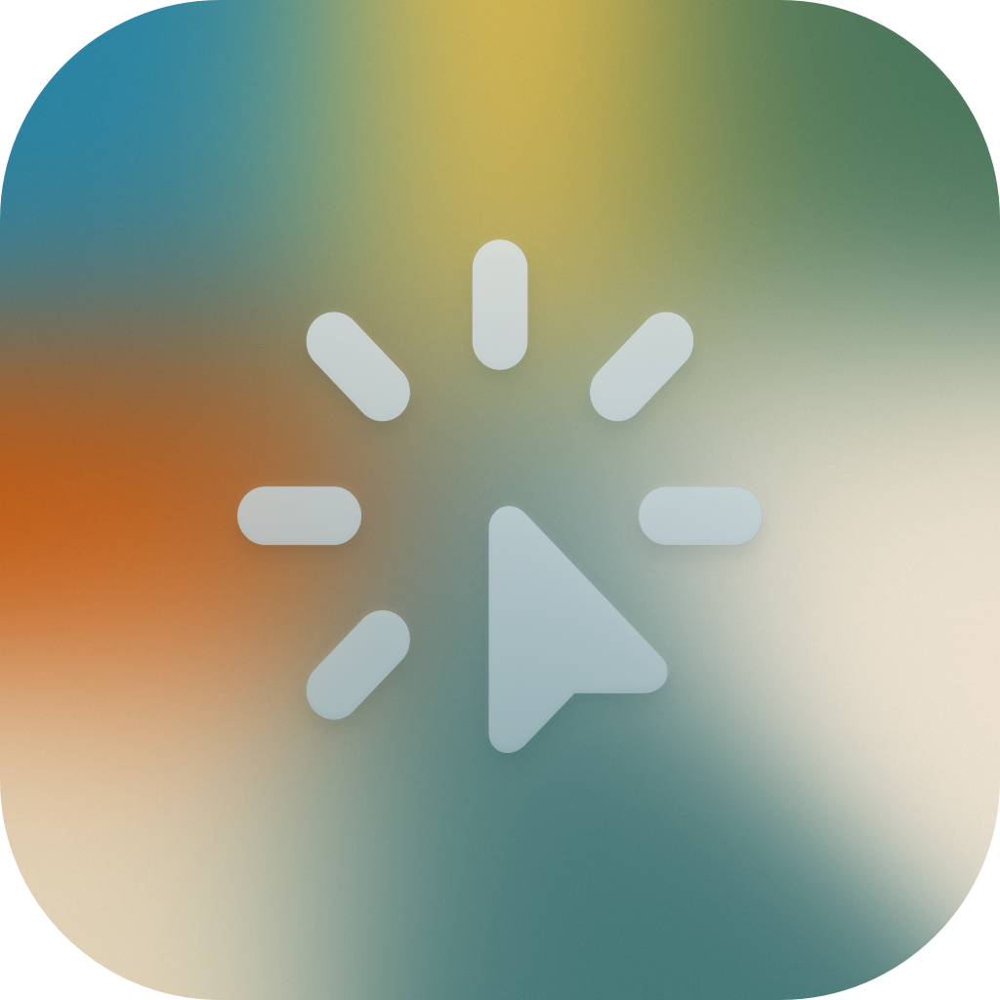

<p align="center">
  
</p>

<h1 align="center">Codex Not Sleep</h1>

<p align="center">
  A native macOS menu bar app that keeps your Mac awake only while Codex is working.
</p>

<p align="center">
  <strong>Version 1.0.0</strong> · macOS 13 or later
</p>

## Download

[Download Codex Not Sleep from GitHub Releases](https://github.com/aachebotok/codexnotsleep/releases/latest)

Download the latest `.dmg`, open it, and drag **Codex Not Sleep** to the Applications folder.

### If macOS blocks the app

The current release is locally signed but not notarized by Apple, so Gatekeeper may show a message saying that Apple could not verify the app for malicious software. To open it:

1. Make sure **Codex Not Sleep.app** has been copied from the DMG to the **Applications** folder.
2. Open the app from **Applications**.
3. In the warning, click **Done**. Do not move the app to the Trash.
4. Open **System Settings → Privacy & Security**.
5. Scroll to **Security** and click **Open Anyway** next to the message about Codex Not Sleep.
6. Confirm with your password, then click **Open**.

If **Open Anyway** is not visible, try opening the app from **Applications** again, dismiss the warning with **Done**, then close and reopen System Settings. macOS shows this option for about one hour after the blocked launch. See [Apple's instructions for opening an app from an unknown developer](https://support.apple.com/guide/mac-help/mh40616/mac).

## What it does

- Detects active Codex tasks automatically
- Adds itself to Login Items on first launch from the Applications folder
- Prevents idle and system sleep only while Codex is working
- Optionally keeps tasks running when the MacBook lid is closed
- Smoothly dims the built-in display and keyboard backlight below 45° as the lid closes, then restores both to their previous brightness at 45°
- Releases sleep protection when the last task finishes
- Restores protection if Codex starts working again
- Allows normal sleep when the battery reaches 10% or lower
- Runs locally with no account, analytics, or API connection

Codex Not Sleep lives entirely in the menu bar. Use the **Stay awake** switch to enable or disable automatic protection at any time.

> Keeping a Mac awake with its lid closed can use more battery and generate heat. Do not leave an active Mac inside a bag or another enclosed space.

## Privacy and permissions

Codex Not Sleep reads lifecycle markers from local Codex session files to determine when a task starts and finishes. It does not store or send your prompts, responses, or source code.

Closed-lid operation requires a one-time administrator confirmation. The app installs a narrow `sudoers` rule that permits only the two required `pmset` commands. Remove that rule with:

```bash
sudo rm /private/etc/sudoers.d/methamphetamine_power_protect_$(id -u)
```

## Build from source

Requirements: macOS 13 or later, Xcode, and a Swift 6 toolchain.

```bash
swift test
./scripts/package.sh
```

The packaging script creates a universal, ad-hoc signed DMG at `dist/Codex-Not-Sleep-1.0.0.dmg`. Public releases must be signed with Developer ID and notarized by Apple.

See [CONTRIBUTING.md](CONTRIBUTING.md) for development guidance and [SECURITY.md](SECURITY.md) for security reporting.
